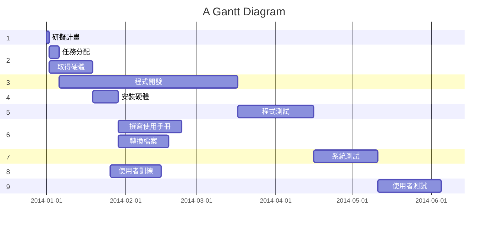
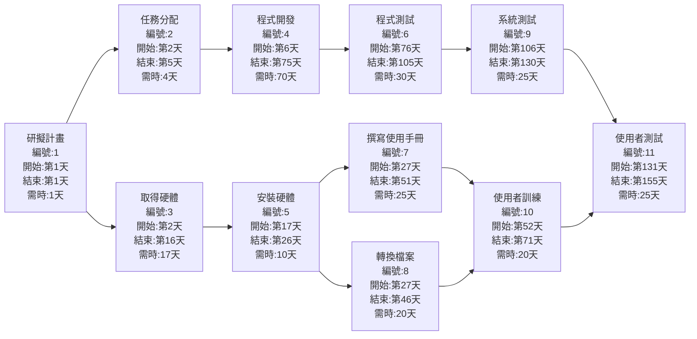

```mermaid
gantt
    title A Gantt Diagram

    section 1
    研擬計畫       :a1, 2014-01-01, 1d
    section 2
    任務分配      :2014-01-02  , 4d
    取得硬體      :2014-01-02  , 17d
    section 3
    程式開發      :2014-01-06  , 70d
    section 4
    安裝硬體      :2014-01-19  , 10d
    section 5
    程式測試      :2014-03-17  , 30d
    section 6
    撰寫使用手冊    :2014-01-29  , 25d
    轉換檔案      :2014-01-29  , 20d
    section 7
    系統測試      :2014-04-16  , 25d
    section 8
    使用者訓練      :2014-01-26  , 20d
    section 9
    使用者測試      :2014-05-11  , 25d
```

```mermaid
flowchart LR
    A[研擬計畫<br>編號:1<br>開始:第1天<br>結束:第1天<br>需時:1天]
    B[任務分配<br>編號:2<br>開始:第2天<br>結束:第5天<br>需時:4天]
    C[取得硬體<br>編號:3<br>開始:第2天<br>結束:第16天<br>需時:17天]
    D[程式開發<br>編號:4<br>開始:第6天<br>結束:第75天<br>需時:70天]
    E[安裝硬體<br>編號:5<br>開始:第17天<br>結束:第26天<br>需時:10天]
    F[程式測試<br>編號:6<br>開始:第76天<br>結束:第105天<br>需時:30天]
    G[撰寫使用手冊<br>編號:7<br>開始:第27天<br>結束:第51天<br>需時:25天]
    H[轉換檔案<br>編號:8<br>開始:第27天<br>結束:第46天<br>需時:20天]
    I[系統測試<br>編號:9<br>開始:第106天<br>結束:第130天<br>需時:25天]
    J[使用者訓練<br>編號:10<br>開始:第52天<br>結束:第71天<br>需時:20天]
    K[使用者測試<br>編號:11<br>開始:第131天<br>結束:第155天<br>需時:25天]

    A --> B
    A --> C
    B --> D
    C --> E
    D --> F
    F --> I
    E --> G
    E --> H
    G --> J
    H --> J
    I --> K
    J --> K
```

關鍵路徑：1->2->4->6->9->11
